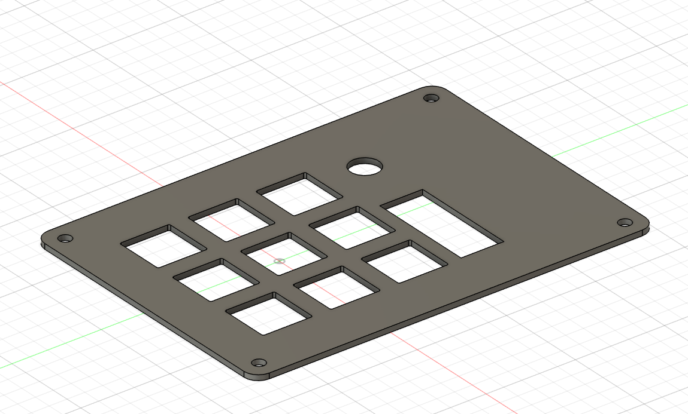
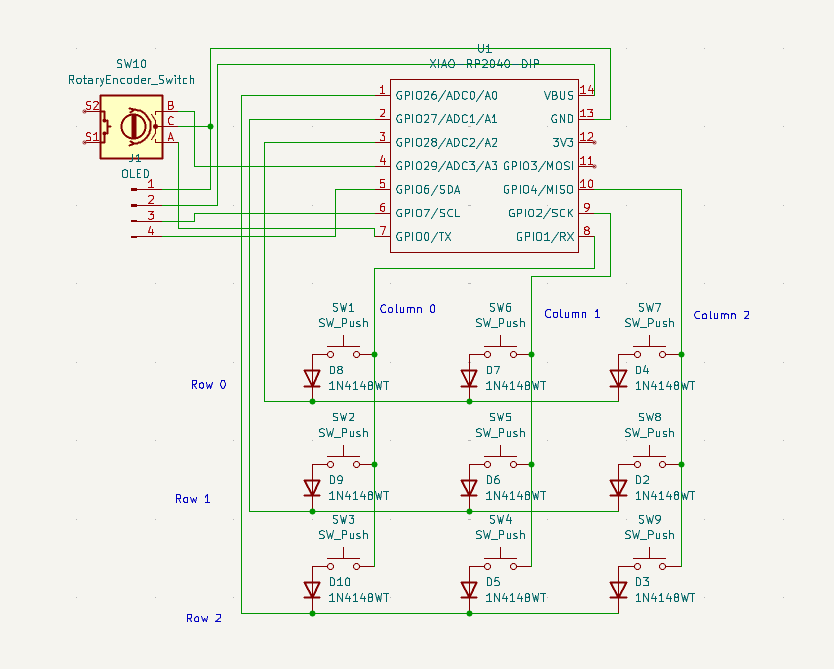

## The Case

## The PCB

## The Schematic

## The Bom
4x M3x16mm screws
4x M3x5mx4mm heatset inserts
9x Blank DSA keycaps
9x MX-Style switches
9x Through-hole 1N4148 Diodes
1x 0.91" 128x32 OLED Display
1x EC11 Rotary Encoder
1x XIAO RP2040
